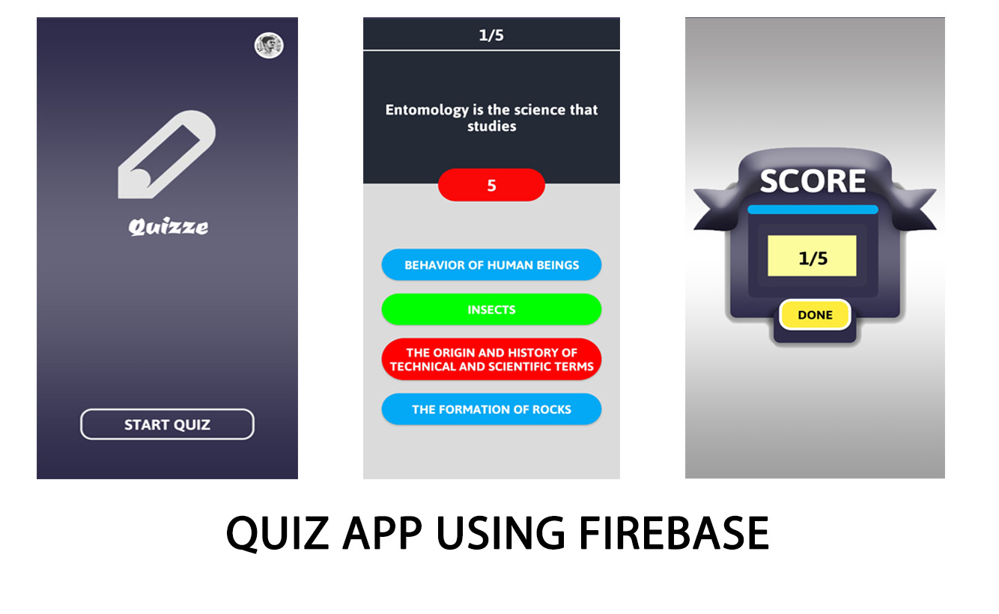
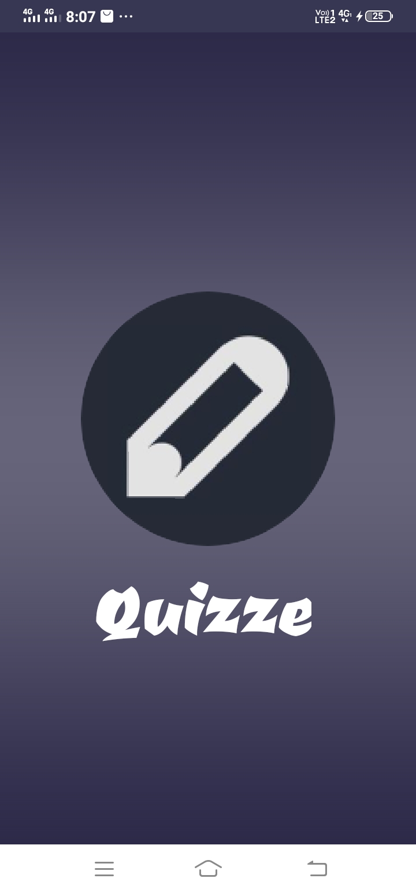
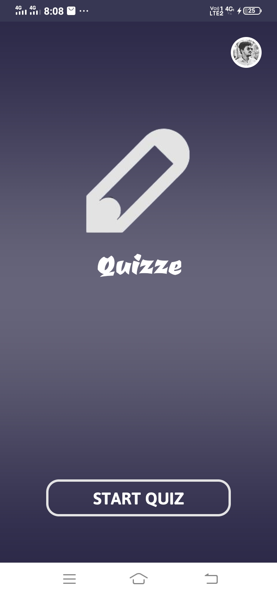
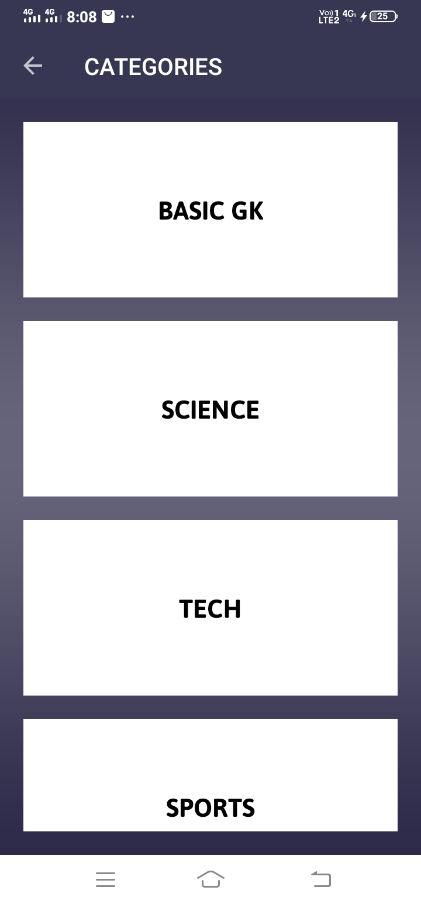
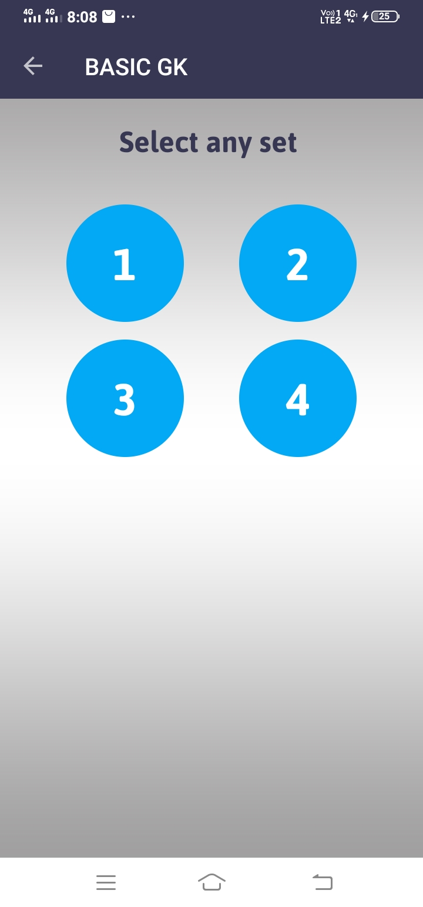
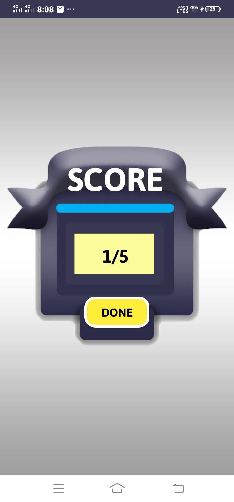

# Quiz_app_using_Firebase

**This is a simple quiz app where Firebase is used as a backend to store the questions and answers.**

## Dependencies

in `build.gradle` **app** we need to the add the *firebase*, *google-play service*, *picasso* and *circle image* dependencies.

in `build.gradle` **project** we need to add *google service*.

**dependencies are in the code. please go through it**

## Getting started

- in **Splash Screen** we simple add our **LOGO** and **NAME** of the app with animation

for animation effect we need to create a resource folder named **anim** inside ``res``, then create a animation resource file.

then we can import that file into our splash screen

- After Splash Screen there is a welcome page with one **START BUTTON** and one **LOGIN BUTTON**. *Check the code insde the folder*

- For **LOGIN** we used only **GOOGLE LOGIN** method using *Firebase*.

- After cliked the **START BUTTON**, we are redirected to the **CATEGORY PAGE**, where we can select any category as per our choice.

- Clicking any of the category bring us to the **SETS** page, where we can found number of sets. In each sets there are multiple number of questions.

- In the question page, for each question we have **four options** one of them is *correct*.

- For each questions we have only **10 seconds**. We need to answer the question within that period of time otherwise it will redirected to us to the next question.

- At the end the questions we get our **score** out of the no of questions.

## Screenshots of the App

       

      

